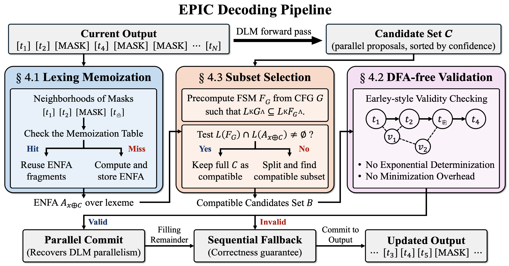
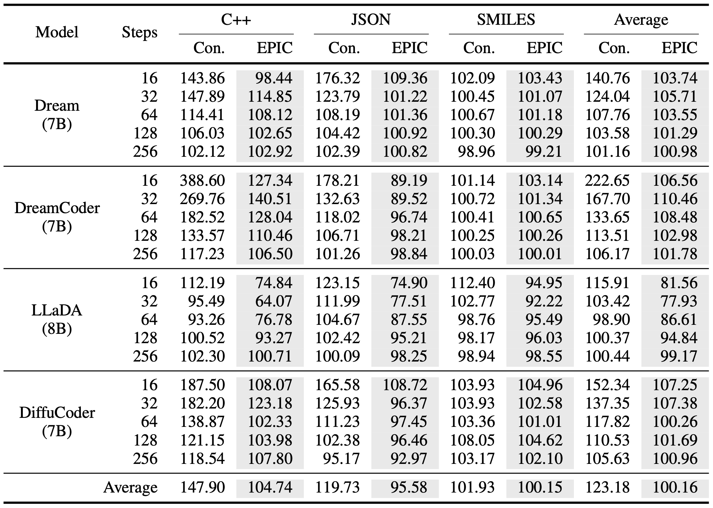
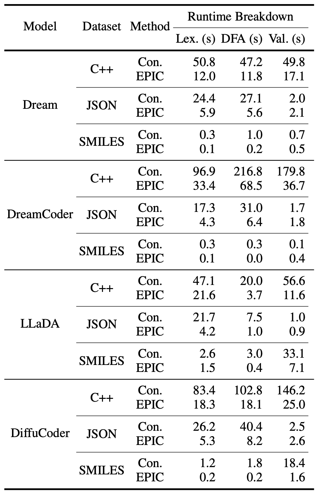
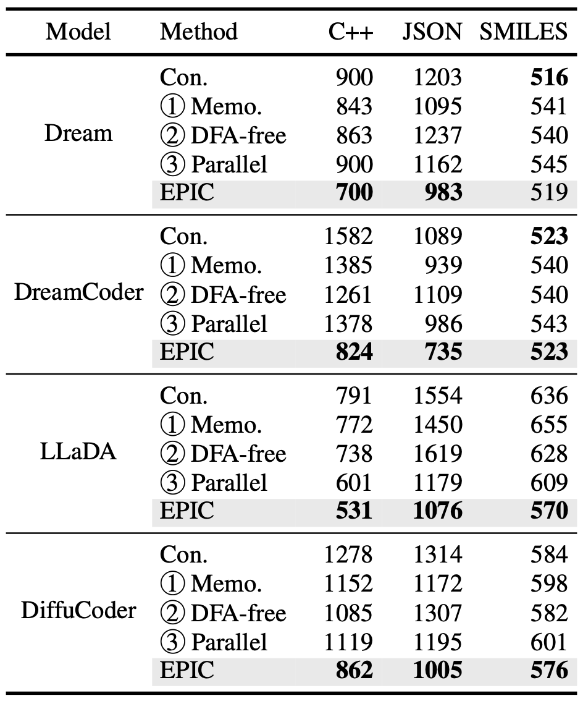

# EPIC: Efficient and Parallel Inference under CFG Constraints for Diffusion Language Models

<p align="center">
  <a href="<PROJECT_GITHUB_URL>/stargazers">
    
  </a>
  <a href="<PROJECT_GITHUB_URL>/commits/main">
    
  </a>
  <a href="<PROJECT_GITHUB_URL>/graphs/contributors">
    
  </a>
</p>

<!-- <div align="center">
    <a href="<PAPER_URL>"><b>Paper Link</b> 📖</a>
</div><br> -->



## 📝 TL;DR

**EPIC** is an efficient CFG-constrained decoding framework for diffusion language models. It keeps the same CFG-based completable-output criterion as prior constrained diffusion decoding, but reduces its main overheads with lexing memoization, DFA-free Earley-style validation, and relaxed compatible subset selection for parallel commit. Across C++, JSON, and SMILES benchmarks, EPIC keeps constrained decoding close to the runtime of unconstrained diffusion decoding while preserving syntactic and functional correctness.

## 🔍 Overview

Diffusion language models generate text through iterative denoising rather than left-to-right next-token prediction. This makes them attractive for low-latency generation because multiple masked positions can be updated in parallel. However, this nonsequential generation process also makes structured generation more difficult. Proposed tokens may violate syntactic dependencies, and validity must be checked over partially filled sequences with unresolved masks.

Recent CFG-constrained decoding methods address this problem by checking whether each proposed update leaves the partial output completable under a target context-free grammar. This enables structured generation for domains such as C++, JSON, and SMILES, but introduces substantial overhead. In particular, prior pipelines repeatedly lex partial outputs, construct and minimize deterministic automata, and validate candidate tokens sequentially.

EPIC targets these bottlenecks directly. It reuses lexical computations across similar partial outputs, checks CFG compatibility directly on graph-structured lexeme representations without per-step DFA construction for exact validation, and recovers part of the parallelism of diffusion decoding by selecting compatible candidate subsets before exact verification. The result is a constrained decoding pipeline that preserves the same acceptance criterion while substantially reducing inference time.

## ✨ What makes EPIC useful?

- **CFG constraints for diffusion LMs**
  EPIC supports structured generation under context-free grammars in diffusion language models, where generation is not strictly left-to-right.

- **Same completable-output criterion as prior CFG-constrained decoding**  
  A partial output is accepted only when the remaining masks can still be completed into a lexeme sequence accepted by the target grammar.

- **Reducing constrained-decoding overhead**
  EPIC combines lexing memoization, DFA-free Earley-style validation, and relaxed compatible subset selection to reduce repeated lexing, avoid per-step DFA construction for exact CFG checks, and recover parallel token commitment.

## ⚡ Quickstart

### Step 1: Clone the repository

```bash
git clone https://github.com/hyundong98/EPIC-Decoding.git
cd EPIC-Decoding
```

### Step 2: Set up the environment

The artifact was tested with Python 3.11 and a recent Rust toolchain. GPU-based model inference requires CUDA-compatible PyTorch and enough GPU memory for the selected model.

Create and activate a Python environment, then install the package and Rust bindings:

```bash
pip install maturin

cd rustformlang_bindings
maturin dev --release
cd ..

pip install -e .
```

### Step 3: Prepare model and dataset access

Full model evaluations require the corresponding model checkpoints and datasets. For offline runs, prepare the Hugging Face cache in advance and set:

```bash
export HF_HUB_OFFLINE=1
export HF_DATASETS_OFFLINE=1
```

### Step 4: Run a diffusion-LM constrained decoding example

```bash
python -m constrained_diffusion.eval.dllm.generic_inference \
  --model_name <MODEL_ID_OR_LOCAL_PATH> \
  --dataset-name jsonschema \
  --steps 32 \
  --max-tokens 256 \
  --temp 0.0 \
  --seed 42 \
  --constrained True
```

### Step 5: Evaluate generated outputs

```bash
python -u eval/evaluate_all.py results/json/[FILE].jsonl --output-dir eval_results/json
```

## 🛠️ Setup

### Requirements

EPIC requires:

```text
Python 3.11
Rust toolchain
maturin
CUDA-compatible PyTorch for GPU inference
```

Install the Rust backend and Python package:

```bash
pip install maturin

cd rustformlang_bindings
maturin dev --release
cd ..

pip install -e .
```

### Repository layout

```text
.
├── constrained_diffusion/
│   ├── cfgs/                 Context-free grammars and schema-to-grammar utilities
│   ├── eval/
│   │   ├── dllm/             Diffusion-LM model, dataset, and inference wrappers
│   │   └── mri/              Multi-region infilling model, dataset, and inference wrappers
│   └── constrain_utils.py    Main Python-side constrained decoding utilities
├── eval/
│   ├── dllm/                 Task-specific checkers for diffusion-LM outputs
│   ├── mri/                  Task-specific checkers for infilling outputs
│   ├── evaluate_all.py       Correctness evaluation entry point
│   └── collect_*.py          Result aggregation scripts
├── rustformlang/             Rust implementation of formal-language operations
├── rustformlang_bindings/    Python bindings for the Rust backend
├── regex-dfa/                Vendored regular-expression/DFA utilities
├── scripts/                  Convenience launchers for larger experiments
├── figures/                  Figures and images used in the README and result summaries
├── pyproject.toml            Python package metadata and dependencies
├── uv.lock                   Locked Python dependency versions
├── THIRD_PARTY_LICENSES.md   Third-party and upstream license notices
└── LICENSE                   Top-level project license
```

## 🚀 Usage

### Running diffusion-LM experiments

The main diffusion-LM entry point is:

```bash
python -m constrained_diffusion.eval.dllm.generic_inference \
  --model_name <MODEL_ID_OR_LOCAL_PATH> \
  --dataset-name jsonschema \
  --steps 32 \
  --max-tokens 256 \
  --temp 0.0 \
  --seed 42 \
  --constrained True
```

Supported diffusion-LM dataset identifiers include:

```text
zai-org/humaneval-x/cpp
jsonschema
smiles
```

Before running larger batches, adjust paths, output directories, and model identifiers in the corresponding launcher scripts to match the local machine.

### Evaluating generations

Use `eval/evaluate_all.py` to compute correctness metrics from generated JSONL files:

```bash
python -u eval/evaluate_all.py results/json/[FILE].jsonl --output-dir eval_results/json
python -u eval/evaluate_all.py results/smiles/[FILE].jsonl --output-dir eval_results/smiles
python -u eval/evaluate_all.py results/cpp/[FILE].jsonl --output-dir eval_results/cpp
```

The helper script `eval/evaluate_all.sh` shows the command pattern used for large-scale evaluation.

### Aggregating results

Use the result aggregation scripts under `eval/` to collect evaluation outputs into summary tables:

```bash
python eval/collect_eval_results.py --help
python eval/collect_analysis_results.py --help
```

## 📊 Experiments

EPIC is evaluated on structured generation tasks where syntactic validity is required and unconstrained diffusion decoding can produce invalid outputs.

| Setting | Task | Constraint | Evaluation |
| --- | --- | --- | --- |
| Diffusion LM | C++ code generation | C++ CFG | Syntax checking and unit tests |
| Diffusion LM | JSON generation | JSON Schema-derived CFG | Schema validity and normalized output match |
| Diffusion LM | SMILES generation | SMILES CFG | Grammar validity and molecular equivalence |

The experiments compare three decoding modes:

| Method | Description |
| --- | --- |
| `Uncon.` | Unconstrained diffusion decoding |
| `Con.` | Prior CFG-constrained diffusion decoder |
| `EPIC` | CFG-constrained decoding with lexing memoization, DFA-free validation, and relaxed compatible subset selection |

The main evaluation covers four instruction-tuned diffusion language models: Dream, DreamCoder, LLaDA, and DiffuCoder. Experiments are run across denoising step counts in `{16, 32, 64, 128, 256}` with a maximum generation length of 256 tokens. Smaller step counts reveal more tokens per denoising step and therefore stress the sequential checking bottleneck more strongly.

## 📈 Results

### Main results



EPIC brings CFG-constrained diffusion decoding close to the runtime of unconstrained decoding. Averaged across all evaluated models, tasks, and denoising-step settings, the prior CFG-constrained decoder runs at **123.18%** of unconstrained decoding time, while EPIC runs at **100.16%**.

The benefit is largest when diffusion parallelism matters most. On DreamCoder with C++ at 16 denoising steps, the prior constrained decoder requires **388.60%** of unconstrained decoding time, whereas EPIC reduces this to **127.34%**. This corresponds to reducing overhead beyond unconstrained decoding from **288.60%** to **27.34%**.

EPIC maintains correctness comparable to the prior CFG-constrained baseline. After witness-based recovery, constrained methods achieve near-perfect syntactic correctness in almost all evaluated settings, while functional correctness remains comparable across models and tasks.

### Runtime breakdown analysis

<p align="center">
  
</p>

EPIC reduces the major sources of constrained-decoding overhead. The prior CFG-constrained decoder spends substantial time on repeated lexing, ENFA-to-DFA conversion, DFA minimization, and CFG validation. EPIC targets these costs with lexing memoization, DFA-free validation, and relaxed compatible subset selection.

The breakdown shows that EPIC reduces lexing time by reusing local lexing results, lowers DFA-related overhead by avoiding per-step DFA construction for exact validation, and reduces sequential exact checks by committing compatible token subsets in parallel.

Component statistics confirm that these optimizations are actively used during decoding: memoization achieves hit rates above **50%** in most settings, and EPIC commits more than **two tokens at once** on average across all models and datasets.

### Ablation study

<p align="center">
  
</p>

The ablation study shows that EPIC’s speedup comes from complementary components rather than a single isolated optimization. Starting from the prior CFG-constrained baseline, adding lexing memoization, DFA-free validation, or relaxed compatible subset selection each reduces runtime in settings where the corresponding bottleneck is significant.

The gains are especially consistent on C++, where the grammar and lexical specification are more complex. In this setting, all three components reduce inference time for every evaluated model. On JSON, lexing memoization and relaxed subset selection are often more effective than DFA-free validation alone, because JSON validation is comparatively cheap once the partial-output representation has been built. On SMILES, the improvements are smaller because the baseline constrained-decoding overhead is already low.

The full EPIC configuration generally gives the best runtime by combining these complementary optimizations, and is never substantially worse than the best ablation setting.

## License

This project is released under the license provided in `LICENSE`.

Third-party components and code adapted from prior work are documented in `THIRD_PARTY_LICENSES.md`. In particular, the vendored `regex-dfa` component is licensed separately under the license files preserved in `regex-dfa/`.
